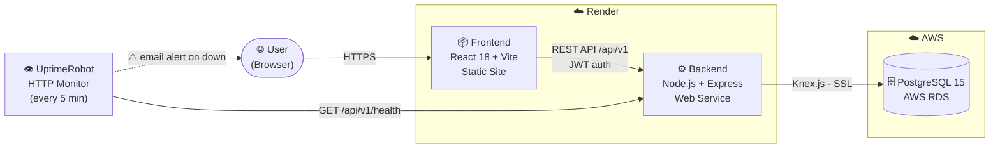

# Triplanner

A trip planning web application built entirely by a multi-agent AI development framework. Eight specialized Claude Code agents collaborate through structured workflows to autonomously plan, design, build, test, and deploy the application across iterative sprints.

## What is Triplanner?

Triplanner is a travel planning hub where users can organize all the details of their upcoming trips in one place. Instead of scattering flight confirmations, hotel bookings, and itineraries across Google Docs, Notion, or email threads, Triplanner consolidates everything into a single, visual interface.

**Core features:**
- **Account management** — sign up and log in with email/password
- **Trip dashboard** — view all trips at a glance with destination, dates, and status (Planning / Ongoing / Completed)
- **Trip details** — a single page per trip with an integrated calendar, flight details, accommodation info, and a day-by-day activity itinerary
- **Inline editing** — add, modify, or remove flights, stays, and activities with save/cancel workflows
- **Calendar integration** — all flights, stays, and activities automatically populate a visual calendar at the top of each trip

**Tech stack:** React 18 + Vite (frontend), Express + Node.js (backend), PostgreSQL + Knex.js (database), JWT authentication

## System Architecture



| Component | Technology | Hosting |
|-----------|-----------|---------|
| Frontend | React 18 + Vite (SPA) | Render — Static Site |
| Backend | Node.js + Express REST API | Render — Web Service |
| Database | PostgreSQL 15 | AWS RDS |
| Monitoring | UptimeRobot HTTP monitor | Cloud (uptimerobot.com) |

**Request flow:** The browser loads the React SPA from Render's static CDN. All API calls go from the frontend to the Express backend (also on Render) via HTTPS, authenticated with short-lived JWT access tokens (15 min) and rotating refresh tokens (7 days). The backend connects to AWS RDS over an SSL-encrypted connection using Knex.js. UptimeRobot pings `/api/v1/health` every 5 minutes and sends an email alert if the backend goes down.

## How the Multi-Agent Framework Works

This project uses a **multi-agent orchestration system** where eight AI agents — each with a specialized role — collaborate to build the application. The agents don't talk to each other directly. Instead, they communicate through structured markdown files in the `.workflow/` directory: task trackers, handoff logs, API contracts, UI specs, and feedback logs.

An automated orchestrator (`orchestrator/orchestrate.sh`) drives the entire sprint lifecycle, invoking each agent in the correct order and handling rework cycles when code review or QA finds issues.

### The Agents

| Agent | Role | What It Does |
|-------|------|-------------|
| **Manager** | Sprint planner & code reviewer | Reads the project brief and feedback, creates tasks, assigns them to engineers, reviews code after implementation |
| **Design Agent** | UI/UX specification writer | Writes detailed screen-by-screen UI specs describing layout, states (empty, loading, error, success), and interactions |
| **Backend Engineer** | API & database developer | Implements routes, models, migrations, validation, and tests based on API contracts |
| **Frontend Engineer** | UI developer | Builds React pages, components, hooks, and styles based on UI specs and API contracts |
| **Deploy Engineer** | Infrastructure & deployment | Handles Docker configs, HTTPS setup, CI/CD, staging deployments, and environment management |
| **QA Engineer** | Tester & security auditor | Runs unit tests, integration tests, security scans, and config consistency checks |
| **Monitor Agent** | Post-deploy health checker | Validates that the deployed app is healthy, configs are consistent across the stack, and endpoints respond correctly |
| **User Agent** | End-user tester | Tests every feature from a real user's perspective, submits structured feedback with severity ratings |

### The Sprint Cycle

Each sprint runs through 10 automated phases:

```
1. Plan       — Manager reads brief/feedback, creates and assigns tasks
2. Design     — Design Agent writes UI specs for frontend tasks
3. Contracts  — Backend Engineer publishes API endpoint contracts
4. Build      — Backend + Frontend + Deploy Engineers implement in parallel
5. Review     — Manager reviews code for quality and conventions
6. QA         — QA Engineer runs tests, security scan, config consistency check
7. Deploy     — Deploy Engineer builds and deploys to staging
8. Verify     — Monitor Agent runs health checks and config validation
9. Test       — User Agent tests from a real user's perspective
10. Closeout  — Manager triages feedback, writes sprint summary
```

If code review or QA finds issues, the orchestrator automatically sends work back for fixes and re-runs the affected phases.

## Prerequisites

Install the following before running the application:

| Dependency | Version | Install |
|-----------|---------|---------|
| **Node.js** | 18+ | [nodejs.org](https://nodejs.org) or `brew install node` |
| **PostgreSQL** | 15+ | `brew install postgresql@15 && brew services start postgresql@15` |
| **Claude Code CLI** | Latest | `npm install -g @anthropic-ai/claude-code` (only needed for the orchestrator) |

After installing PostgreSQL, add the binaries to your PATH if they aren't found:

```bash
echo 'export PATH="/opt/homebrew/opt/postgresql@15/bin:$PATH"' >> ~/.zshrc
source ~/.zshrc
```

## Running the Application Locally

### 1. Create the database

```bash
createdb appdb
```

If the database already exists, this step will print an error — that's fine, skip it.

### 2. Install dependencies

```bash
cd backend && npm install
cd ../frontend && npm install
cd ..
```

### 3. Configure the backend environment

The `.env` file should already exist at `backend/.env`. For local development, make sure it has these values:

```env
PORT=3000
NODE_ENV=development
DATABASE_URL=postgres://localhost:5432/appdb
JWT_SECRET=<any-random-string>
JWT_EXPIRES_IN=15m
JWT_REFRESH_EXPIRES_IN=7d
CORS_ORIGIN=http://localhost:5173
COOKIE_SECURE=false
```

If `SSL_KEY_PATH` and `SSL_CERT_PATH` are set, comment them out for local dev — otherwise the backend starts in HTTPS mode and the Vite proxy can't reach it.

### 4. Run database migrations

```bash
cd backend && npm run migrate
```

### 5. Start the backend and frontend

In one terminal:
```bash
cd backend && npm run dev
```

You should see: `HTTP Server running on http://localhost:3000`

In another terminal:
```bash
cd frontend && npm run dev
```

You should see: `VITE ready` at `http://localhost:5173/`

### 6. Open the app

Navigate to [http://localhost:5173](http://localhost:5173) in your browser.

### Running Tests

```bash
cd backend && npm test     # Backend unit tests (Vitest)
cd frontend && npm test    # Frontend unit tests (Vitest + React Testing Library)
```

## Using the Multi-Agent Framework

The orchestrator automates the full development lifecycle. Here's how to use it to build new features.

### Initial Setup

```bash
# Run the setup script (installs dependencies, initializes git, checks tools)
./orchestrator/setup.sh
```

### Describing What to Build

Edit `.workflow/project-brief.md` with your product vision. This is the single source of truth that the Manager Agent reads when planning sprints. Be specific — include user flows, feature descriptions, and design preferences.

### Running a Sprint

```bash
# Run a single sprint (plan through closeout)
./orchestrator/orchestrate.sh

# Run sprints in a loop (pauses for feedback between sprints)
./orchestrator/orchestrate.sh --loop

# Resume from where you left off after an interruption
./orchestrator/orchestrate.sh --continue

# Prevent macOS sleep while the sprint runs (sleep resumes when it finishes)
caffeinate -s ./orchestrator/orchestrate.sh --continue

# Check current sprint status
./orchestrator/orchestrate.sh --status

# Clear all state and start fresh
./orchestrator/orchestrate.sh --reset
```

### Adding a New Feature

To add a feature (e.g., "add a packing list to each trip"):

1. **Write it into the project brief** — add the feature to the "Core Features" section of `.workflow/project-brief.md` with enough detail for the agents to understand what to build

2. **Optionally add feedback** — if a sprint already completed, add your feature request to `.workflow/feedback-log.md`:
   ```
   | Feedback | Sprint: N | Category: Feature Gap | Severity: Major | Status: New |
   | Details: Add a packing list section to the trip details page where users can create categorized checklists (clothes, toiletries, documents, etc.) |
   ```

3. **Run the orchestrator** — `./orchestrator/orchestrate.sh` or `./orchestrator/orchestrate.sh --loop`

4. **Review the output** — after the sprint completes, review the code changes, test the running app, and read the sprint summary in `.workflow/sprint-log.md`

5. **Provide feedback** — add observations to `.workflow/feedback-log.md` and run the next sprint to incorporate them

### Providing Feedback Between Sprints

After each sprint, the orchestrator pauses (unless `AUTO_CONTINUE=true` in `orchestrator/config.sh`). This is your chance to:

- Test the running application
- Read the sprint summary in `.workflow/sprint-log.md`
- Add feedback to `.workflow/feedback-log.md` with structured entries:
  - **Bug** — something is broken
  - **UX Issue** — it works but the experience is poor
  - **Feature Gap** — something is missing
  - **Positive** — something works well (keeps morale context for agents)
  - **Suggestion** — an idea for improvement

The Manager Agent reads this feedback when planning the next sprint and prioritizes accordingly.

### Orchestrator Configuration

Edit `orchestrator/config.sh` to adjust behavior:

| Setting | Default | Description |
|---------|---------|-------------|
| `PLATFORM` | `"web"` | `"web"` for React + Vite, `"mobile"` for React Native + Expo |
| `AGENT_MAX_TURNS` | `75` | Max API round-trips per agent (higher = more complex work, higher cost) |
| `AUTO_CONTINUE` | `"true"` | `"true"` = fully autonomous, `"false"` = pause between sprints for human review |
| `MAX_SPRINTS` | `0` | Cap on total sprints (0 = unlimited) |
| `MAX_AGENT_RETRIES` | `2` | Retries per agent before failing a phase |
| `MAX_REWORK_CYCLES` | `2` | Max review-fix cycles before moving on |

### Claude Code Skills

Two custom skills are available when using Claude Code in this project:

| Skill | Command | When to Use |
|-------|---------|-------------|
| **feedback** | `/feedback <description>` | Add a feature request or bug report to the feedback log. Automatically assigns the next FB number, categorizes it, and appends a structured entry. |
| **ops** | `/ops` | Diagnose and fix orchestrator issues. Use when a sprint phase fails, an agent hangs, or the pipeline is stuck. Activates the Orchestrator Ops Agent. |

**Examples:**

```
/feedback The calendar should highlight today's date with a blue circle
/feedback When I delete a trip, there's no confirmation dialog — I accidentally deleted one
/ops
```

### Troubleshooting the Orchestrator

If the orchestrator hangs or fails, invoke the Orchestrator Ops Agent:

```
claude "Act as the Orchestrator Ops Agent in .agents/orchestrator-ops.md"
```

This meta-agent diagnoses hung processes, broken state files, and script errors. It follows a structured triage sequence documented in `.agents/orchestrator-ops.md`.

**Important state files:** The orchestrator relies on `orchestrator/.state` (tracks the current sprint number) and `orchestrator/.sprint-state` (tracks phase completion within a sprint). These are auto-managed by the orchestrator scripts. If `.state` is missing or has a stale `SPRINT_NUMBER`, the orchestrator will start the wrong sprint. If lost, check `grep 'Sprint #' .workflow/active-sprint.md` and recreate manually.

Common issues and quick fixes:
- **Agent hangs on `npm test`** — ensure both `package.json` files use `"test": "vitest run"` (not `"vitest"`, which runs in watch mode)
- **Wrong sprint number** — check `orchestrator/.state` and correct `SPRINT_NUMBER`
- **Phase re-runs unnecessarily** — clear `orchestrator/.sprint-state` and use `--continue`

## Project Structure

```
.agents/              Agent system prompts (one per role)
.workflow/            Workflow docs: task tracker, handoff log, API contracts,
                      UI specs, feedback log, sprint log, security checklist
orchestrator/         Automated sprint runner
  orchestrate.sh        Main entry point
  setup.sh              Environment bootstrap
  config.sh             Local configuration
  lib/                  Shared utilities (state, logging, agent runner)
  phases/               Phase scripts (01-plan through 10-closeout)
  platforms/            Platform-specific configs (web.sh, mobile.sh)
  logs/                 Agent execution logs
frontend/             React 18 + Vite application
backend/              Express + PostgreSQL API
infra/                Docker, nginx, TLS certs, CI/CD configs
```
